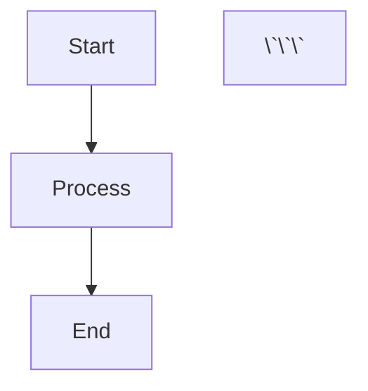

# VISUAL ELEMENTS & ENHANCEMENTS TRACKER
# Java Learning Materials - Visual Aids & Presentation

**Document Created:** January 4, 2026
**Last Updated:** January 4, 2026
**Purpose:** Track visual aids, diagrams, and presentation enhancements for learning materials
**Status:** Planning Phase

---

## 📊 OVERVIEW

**Current State:** All materials are text-based (Markdown + code)
**Goal:** Enhance learning materials with visual aids and better presentation

---

## 🎨 VISUAL ELEMENTS NEEDED

### Priority 1: Essential Diagrams ⭐⭐⭐

#### Core Java Concepts

**Variables & Data Types (Day 2)**
- [ ] Primitive data types size chart
- [ ] Memory allocation diagram
- [ ] Type casting flowchart
- [ ] Variable scope visualization

**Control Flow (Days 4-5)**
- [ ] if-else decision tree
- [ ] switch-case flowchart
- [ ] Loop execution flow (while, for, do-while)
- [ ] Nested loop visualization
- [ ] break/continue flow diagram

**Arrays (Days 6-7)**
- [ ] 1D array memory layout
- [ ] 2D array visualization
- [ ] Array indexing diagram
- [ ] Array operations flowchart

**Methods (Days 8-9)**
- [ ] Method call stack diagram
- [ ] Parameter passing visualization
- [ ] Return value flow
- [ ] Method overloading decision tree
- [ ] Variable scope levels diagram

**OOP Concepts (Days 10-14)**
- [ ] Class vs Object diagram
- [ ] Object creation in memory
- [ ] Constructor execution flow
- [ ] Encapsulation visualization
- [ ] Inheritance hierarchy tree
- [ ] Method overriding diagram
- [ ] Polymorphism visualization
- [ ] Access modifiers matrix

**Collections (Days 19-20)**
- [ ] Collection hierarchy diagram
- [ ] ArrayList internal structure
- [ ] HashMap internal working
- [ ] Set vs List vs Map comparison

**Exception Handling (Days 17-18)**
- [ ] Exception hierarchy tree
- [ ] try-catch-finally flow
- [ ] Exception propagation diagram

**File I/O (Days 22-23)**
- [ ] File operations flowchart
- [ ] Stream hierarchy diagram
- [ ] Serialization process

---

### Priority 2: Supplementary Visuals ⭐⭐

**Pattern Printing (Supplementary Section 3)**
- [ ] Pattern building visualization
- [ ] Nested loop execution trace
- [ ] Space calculation diagram

**Array Algorithms (Supplementary Section 4)**
- [ ] Array rotation visualization
- [ ] Sliding window animation concept
- [ ] Two-pointer technique diagram
- [ ] Merge process visualization

**Integration Challenges (Supplementary Section 5)**
- [ ] System architecture diagrams
- [ ] Data flow diagrams
- [ ] Class relationship diagrams

---

### Priority 3: Enhancement Visuals ⭐

**General Enhancements**
- [ ] Color-coded syntax examples
- [ ] Comparison tables with icons
- [ ] Process flowcharts
- [ ] Memory diagrams
- [ ] Timeline visualizations

---

## 🖼️ DIAGRAM SPECIFICATIONS

### Diagram Types Needed

| Type | Tool Options | Use Cases | Quantity Needed |
|------|-------------|-----------|-----------------|
| **Flowcharts** | Draw.io, Mermaid, Lucidchart | Control flow, algorithms | ~25 |
| **UML Diagrams** | PlantUML, Draw.io | Class diagrams, relationships | ~15 |
| **Memory Diagrams** | Custom drawings | Memory allocation, stack/heap | ~10 |
| **Tree Diagrams** | Mermaid, GraphViz | Inheritance, exceptions | ~8 |
| **Sequence Diagrams** | PlantUML, Mermaid | Method calls, program flow | ~5 |
| **Comparison Tables** | Markdown enhanced | Feature comparisons | ~20 |

**Total Diagrams Needed:** ~83 visual elements

---

## 📋 DETAILED TODO LIST

### Phase 1: Core Concept Diagrams (High Priority)

#### Week 1 Visuals (Days 1-7)

**Day 1: Introduction & Setup**
- [ ] JDK vs JRE vs JVM architecture diagram
- [ ] Java compilation process flowchart
- [ ] IDE setup screenshot guide
- [ ] First program execution flow

**Day 2: Variables & Data Types**
- [ ] 8 primitive types size comparison chart
- [ ] Memory allocation for primitives
- [ ] Type casting diagram (widening/narrowing)
- [ ] Variable declaration syntax breakdown

**Day 3: Operators**
- [ ] Operator precedence pyramid
- [ ] Expression evaluation tree
- [ ] Comparison operators truth table

**Day 4: Conditionals**
- [ ] if-else decision tree
- [ ] switch-case flowchart
- [ ] Nested if visualization
- [ ] Ternary operator breakdown

**Day 5: Loops**
- [ ] while loop flowchart
- [ ] for loop execution diagram
- [ ] do-while flowchart
- [ ] Loop comparison table
- [ ] Nested loop execution trace

**Day 6-7: Arrays**
- [ ] 1D array memory layout
- [ ] Array indexing (0-based) diagram
- [ ] 2D array visualization
- [ ] Jagged array structure
- [ ] Array traversal patterns

**Estimated:** 25 diagrams, 10-15 hours work

---

#### Week 2 Visuals (Days 8-14)

**Day 8-9: Methods**
- [ ] Method structure anatomy
- [ ] Call stack visualization
- [ ] Parameter passing diagram
- [ ] Return value flow
- [ ] Method overloading decision matrix
- [ ] Scope levels diagram (local, instance, static)

**Day 10: OOP Introduction**
- [ ] Class blueprint vs Object instance
- [ ] Object creation in heap memory
- [ ] Instance variables in memory
- [ ] Constructor execution sequence

**Day 11: Encapsulation**
- [ ] Access modifiers visibility chart
- [ ] Getter/setter pattern diagram
- [ ] Data hiding visualization
- [ ] Encapsulation benefits flowchart

**Day 12: Inheritance**
- [ ] Parent-child relationship diagram
- [ ] Inheritance hierarchy tree
- [ ] super keyword flow
- [ ] Method overriding visualization
- [ ] Constructor chaining diagram

**Day 13: Polymorphism**
- [ ] Compile-time vs runtime polymorphism
- [ ] Dynamic method dispatch diagram
- [ ] Upcasting/downcasting visualization
- [ ] instanceof check flowchart

**Day 14: Review**
- [ ] Complete OOP concepts mind map
- [ ] Relationship diagram (all concepts)
- [ ] School management system architecture

**Estimated:** 30 diagrams, 12-18 hours work

---

#### Week 3-5 Visuals (Days 15-30)

**Strings (Day 15)**
- [ ] String pool diagram
- [ ] String immutability visualization
- [ ] StringBuilder vs StringBuffer comparison

**Collections (Days 19-20)**
- [ ] Collection framework hierarchy
- [ ] ArrayList internal array
- [ ] HashMap bucket structure
- [ ] Set operations Venn diagram

**Exceptions (Days 17-18)**
- [ ] Exception class hierarchy
- [ ] try-catch-finally flow
- [ ] Exception propagation chain

**File I/O (Days 22-23)**
- [ ] Stream class hierarchy
- [ ] File reading process flow
- [ ] Serialization diagram

**Java 8 Features (Day 24)**
- [ ] Lambda expression breakdown
- [ ] Stream pipeline visualization

**Estimated:** 28 diagrams, 12-15 hours work

---

### Phase 2: Selenium Visuals

**Selenium Architecture**
- [ ] WebDriver architecture diagram
- [ ] Browser driver communication flow
- [ ] Selenium component diagram

**Locators**
- [ ] DOM tree visualization
- [ ] XPath axes diagram
- [ ] CSS selector syntax breakdown

**Waits**
- [ ] Wait types comparison
- [ ] Synchronization timeline
- [ ] Wait strategy flowchart

**Page Object Model**
- [ ] POM architecture diagram
- [ ] Page class structure
- [ ] Test flow with POM

**Framework**
- [ ] Complete framework architecture
- [ ] Folder structure diagram
- [ ] Test execution flow

**Estimated:** 20 diagrams, 8-12 hours work

---

## 🛠️ TOOLS & RESOURCES

### Recommended Tools

**For Flowcharts & Diagrams:**
- [ ] **Mermaid.js** (text-based, integrates with Markdown)
- [ ] **Draw.io** (free, online/desktop)
- [ ] **Lucidchart** (professional, paid)
- [ ] **PlantUML** (text-based UML)

**For Code Diagrams:**
- [ ] **Carbon** (beautiful code screenshots)
- [ ] **Ray.so** (code screenshots)

**For Mind Maps:**
- [ ] **XMind** (free/paid)
- [ ] **MindMeister** (online)

**For Animations (Optional):**
- [ ] **Manim** (mathematical animations)
- [ ] **Canva** (simple animations)

---

## 📊 PROGRESS TRACKING

### Visual Elements Status

```
Phase 1: Core Concepts    ░░░░░░░░░░░░░░░░░░░░   0% (0/83)
Phase 2: Selenium         ░░░░░░░░░░░░░░░░░░░░   0% (0/20)
Phase 3: Enhancements     ░░░░░░░░░░░░░░░░░░░░   0% (0/15)

Total Visual Elements:    ░░░░░░░░░░░░░░░░░░░░   0% (0/118)
```

---

## 📅 TIMELINE

### Suggested Schedule

**Phase 1: Essential Diagrams**
- Week 1 visuals: 2-3 sessions (10-15 hours)
- Week 2 visuals: 3-4 sessions (12-18 hours)
- Week 3-5 visuals: 3-4 sessions (12-15 hours)

**Phase 2: Selenium Visuals**
- 2-3 sessions (8-12 hours)

**Phase 3: Enhancements**
- 1-2 sessions (5-8 hours)

**Total Time Estimate:** 47-68 hours

---

## 🎯 INTEGRATION PLAN

### How to Add Visuals to Existing Content

**Option 1: Inline Images**
```markdown

```

**Option 2: Mermaid Diagrams**
```markdown


**Option 3: External Links**
```markdown
[View Flowchart](link-to-diagram)
```

---

## 💡 ENHANCEMENT IDEAS

### Beyond Static Diagrams

**Interactive Elements:**
- [ ] Interactive code examples (CodePen, JSFiddle)
- [ ] Animated GIFs for loop execution
- [ ] Step-by-step execution visualizations
- [ ] Interactive quizzes with visual feedback

**Video Content:**
- [ ] Concept explanation videos
- [ ] Coding walkthrough videos
- [ ] Problem-solving demonstrations

**Additional Resources:**
- [ ] Printable cheat sheets
- [ ] Quick reference cards
- [ ] Visual study guides

---

## 📋 TASK PRIORITIES

### Immediate (Next 2 Weeks)
1. Create OOP concept diagrams (Days 10-14 upcoming)
2. Method and scope visualizations (Days 8-9 completed)
3. Control flow diagrams (most referenced)

### Short-term (Next Month)
1. Complete Week 1-2 visuals
2. Collections diagrams
3. Exception handling flowcharts

### Long-term (Next 2-3 Months)
1. Selenium visuals
2. Advanced topic diagrams
3. Interactive elements

---

## 🎨 DESIGN STANDARDS

### Visual Consistency

**Color Scheme:**
- Primary: #2563eb (blue)
- Success: #10b981 (green)
- Warning: #f59e0b (orange)
- Error: #ef4444 (red)
- Neutral: #6b7280 (gray)

**Typography:**
- Code: `Consolas`, `Monaco`, monospace
- Headings: Bold, clear hierarchy
- Body: Readable, consistent sizing

**Layout:**
- Consistent spacing
- Clear labels
- Logical flow direction (top-to-bottom, left-to-right)

---

## 📊 METRICS

### Visual Aid Impact

**To Track:**
- [ ] Student comprehension improvement
- [ ] Time to understand concepts
- [ ] Visual reference usage
- [ ] Feedback on diagram clarity

**Success Criteria:**
- Clear and self-explanatory diagrams
- Enhances text explanations
- Quick visual reference
- Professional quality

---

## 🔄 MAINTENANCE

### Regular Updates

**When to Update:**
- When content is added/modified
- When concepts are clarified
- When better visualization is available
- Based on student feedback

**Review Schedule:**
- After each week's content completion
- Monthly review of existing visuals
- Quarterly enhancement review

---

## 📝 NOTES

**Current Status:**
- All learning materials are text + code only
- No visual aids currently exist
- This is an enhancement project
- Not blocking content creation

**Recommendation:**
- Focus on content first (current approach)
- Add visuals incrementally
- Prioritize most complex concepts
- Use student feedback to guide priorities

---

**Document Status:** Planning Phase
**Next Action:** Decide on tool selection and create first diagrams
**Estimated Total Work:** 47-68 hours
**Priority:** Medium (enhance existing content)

---

*This tracker focuses on visual enhancements to the text-based learning materials. It is separate from the main content development tracked in PROJECT_TODO_TRACKER.md*
